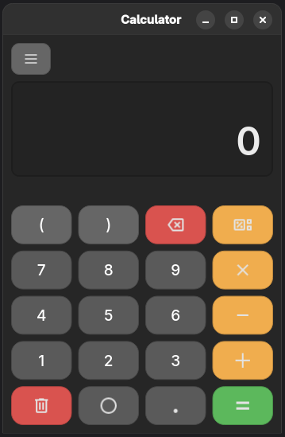

## UrbanCalc
   

It's probably weird that I decided to make a calculator, since this is usually the first project people start coding with. Well, there are a few reasons for this decision: 
`1) I need to get to grips with the Slint graphics framework. `
`2) I simply haven't found a good cross-platform calculator I like, so I decided to write one specifically for myself:)`

### Description

A cross-platform calculator with a graphical interface, customization, and functionality tailored to my needs. It's written in Rust using the Slint framework, and serves as my training in writing interfaces in Slint (and as a personal calculator for my own systems).

### Functional (It's not a fact that I will implement it))
- [x] Addition
- [x] Subtraction
- [x] Division
- [x] Multiplication
- [x] Clear screen / delete symbol
- [x] Brackets
- [ ] Copying / pasting text
- [ ] Exponentiation
- [ ] Square root
- [ ] Trigonometry
- [ ] Equations
- [ ] Functions / graphs
- [ ] Exchange rates
- [ ] Number systems
- [ ] Units of measurement
- [ ] Settings menu //TODO
- [ ] Customization //TODO

### Platfotms
The UrbanCalc is being developed and used on Linux. Rust and Slint allow it to be used on other platforms, but so far it has only been tested on Linux; I'll test it on other systems in the future.

### P.S. 
Slint is a really cool thing, but only if you make your own widgets (like I did with buttons), because the standard widgets suck.